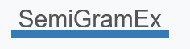

<!-- [![Contributors][contributors-shield]][contributors-url]
[![Forks][forks-shield]][forks-url]
[![Stargazers][stars-shield]][stars-url]
[![Issues][issues-shield]][issues-url]
[![MIT License][license-shield]][license-url]
[![LinkedIn][linkedin-shield]][linkedin-url] -->


<!-- PROJECT LOGO -->
<!-- <br /> --> 

<!-- <p align="center">
    
-->
  <h1 align="center">SemiGramEx</h3>

  <p align="center">
    A semi-automatic generation system for grammar exercises, aiming to help second language teachers.
    <br />
    <!-- <a href="https://github.com/othneildrew/Best-README-Template"><strong>Explore the docs »</strong></a>
    <br />
    <br />
    <a href="https://github.com/othneildrew/Best-README-Template">View Demo</a>
    ·
    <a href="https://github.com/othneildrew/Best-README-Template/issues">Report Bug</a>
    ·
    <a href="https://github.com/othneildrew/Best-README-Template/issues">Request Feature</a>-->
  </p>
</p>


<!-- TABLE OF CONTENTS -->
<!-- <details open="open">
  <summary>Table of Contents</summary>
  <ol>
    <li>
      <a href="#about-the-project">About The Project</a>
      <ul>
        <li><a href="#built-with">Built With</a></li>
      </ul>
    </li>
    <li>
      <a href="#getting-started">Getting Started</a>
      <ul>
        <li><a href="#prerequisites">Prerequisites</a></li>
        <li><a href="#installation">Installation</a></li>
      </ul>
    </li>
    <li><a href="#usage">Usage</a></li>
    <li><a href="#roadmap">Roadmap</a></li>
    <li><a href="#contributing">Contributing</a></li>
    <li><a href="#license">License</a></li>
    <li><a href="#contact">Contact</a></li>
    <li><a href="#acknowledgements">Acknowledgements</a></li>
  </ol>
</details>
-->


<!-- ABOUT THE PROJECT ---->
## About The Project


<!-- [![Product Name Screen Shot][product-screenshot]](https://example.com) -->

* SemiGramEx is a semi-automatic generation system that aims on helping second language teachers, during their duties.

* More specifically, the user can select an initial resource of authentic text, based on which the exercise generation process will happen. In addition, a number of generation parameters have also been incorporated, such as a difficulty level, an exercise type and a teaching goal to be taught of.

* For the moment, SemiGramEx supports only English and it allows for three types of exercises, those being Fill-in-the-blank grammar exercises, Find-the-mistakes and Multiple-choice grammar exercises. Eventually, the teaching goal supported for the moment targets the learning of Verb Tenses. A more thorough description of each component is presented at the How to use section.

* SemiGramEx was created as a part of a second year Master internship, for the Synalp team, at Loria research center.


## Built With

<!-- * [Bootstrap](https://getbootstrap.com) -->
* Python
* Pytorch
* HTML5, CSS3, JQuery
* Flask

## Prerequisites

* python3
* flask
* spacy
* pandas
* pyinflect
* fpdf
* better-profanity


<!-- ### Installation

1. Get a free API Key at [https://example.com](https://example.com)
2. Clone the repo
   ```sh
   git clone https://github.com/your_username_/Project-Name.git
   ```
3. Install NPM packages
   ```sh
   npm install
   ```
4. Enter your API in `config.js`
   ```JS
   const API_KEY = 'ENTER YOUR API';
   ```
-->


<!-- USAGE EXAMPLES -->
## Usage

* The project is not yet available online, so it should be downloaded to be used. 
* NOTE: Due to size limitations, the input resources are not provided. To acquire them, please contact with the creator (email at the end).

1. Open a python terminal and move to the directory where the SemiGrammEx folder is saved.

2. In the root SemiGrammEx directory, run the server with the following command:
   ```sh
   python ./app.py
   ```
   
3. Once the server is running, open a web browser (Chrome for the best results) and accesss the localhost on the port 5000:
   ```sh
   localhost:5000 (http://127.0.0.1:5000/)
   ```
   
4. After that, the web-interface can be used to try SemiGrammEx and generate exercises.


<!-- GETTING STARTED -->
## Getting Started


### Input resource

* SemiGramEx comes with two pre-existing text resources, that act as a generation basis.

* The first resource is the Simple Wikipedia, a version of the Wikipedia database that targets children, young adults and adults who are learning English.

* The second resource is the British National Corpus (BNC), a collection of texts from a wide range of genres (e.g. spoken, fiction, magazines, newspapers, and academic), created by Oxford University press in the 1980s - early 1990s. Note that the BNC corpus for the moment is experimental and therefore many incosistencies might exist on the generated results.

* The language being incorporated in every generated exercise instance, exists in one of those two corpora.


### Number of exercise instances

* The allowed numbers of exercise instances are predefined so that the generation execution might be minimized.

* Given a teaching goal and a number of exercise instances, SemiGramEx will generate half of the number of instances for the first verb tense existing in the teaching goal and the other half for the second verb tense existing in the teaching goal. (see also at the "Grammar exercises" section for more information).

* For example, a number of 20 exercise instances and a Past Simple/Progressive teaching goal, will generate 10 exercises for the Past Simple tense and 10 exercises for the Past Progressive tense.


### Difficulty level

* The difficulty level is based on the language being used in the exercises (meaning the language that exists on the sentences that are retrieved from the input resources, and are to be converted) and not on the exercise type or any other, pedagogically related aspect.

* The difficulty classification results do not aim to be directly demonstrated on a second language learner. On the contrary, this classification approach was implemented upon the assumption that a teacher would interfere and evaluate the validity of the genrated results before demonstrating them on a learner.


### Grammar exercises


#### Exercise type

* The Fill-in-the-blank exercise, is a usual exercise type where the linguistic construction to be taught of, is being blanked and the lemma form is is demonstrated as a hint to the learner. Eg: Thomas _____ (go) to the cinema yesterday.

* The Find-the-mistake exercise, is an exercise type where well-formed sentences are converted into ill-formed ones, with relevant mistakes. The learner should eventually identify and correct the mistakes or even just identify that a mistake exists in a sentence. For example, the sentence: Thomas was going to the cinema yesterday. could be an ill-formed version of the sentence: Thomas went to the cinema yesterday.

* The Multiple-choice exercise, is an exercise type similar with the Fill-in-the-blank one. The main difference, is that instead of presenting the lemma form as a hint for the learner, the solution is demonstrated as an option to the learner, along with a set of wrong options.


#### Teaching goal

* SemiGrammEx targets for the moment Verb Tenses learning. More specifically, three groups of Verb Tenses are provided, those being the Present Simple and Present Progressive group, the Past Simple and Past Progressive group and the Present Perfect and Past perfect group. Those Verb Tenses were chosen as the most suitable learning candidates, given the available input resources.

* Each exercise type, targets those six Verb Tenses in groups, meaning that half of the generated exercise types would concern the first verb tense existing in a target group, and the other half, the other verb tense in the same group. Eg: for a Fill-in-the-blank exercise type, for the Present Simple/Progressive group and a number of 10 exercise instances to be generated, 5 FIB exercise instances would be generated for the Present Simple tense and 5 for the Present Progressive.


### Extra options


#### Display solutions

* The selection of that option will demonstrated the generated exercise, as well as the solutions of the final generated exercises.


#### Highlight topic-sensitive words

* With this option, possible words that might be considered as inappropriate for educational purposes, are indicated by SemiGramEx in the generated exercises.

* Such words are mostly related to offensive use of language or other relevant sensitive topics.

* The provided indications should not be considered as exhaustive. In any case, the final results should be revised.


#### Shuffle exercise instances

* If this option remains unchecked, the generated exercise instances will be sorted based on verb tense. For example, in a scenario of 20 exercise instances, for Present Simple/Progressive tense and the shuffle option unchecked, SemiGrammEx will present 10 exercise instances of Present Simple and then 10 exercise instances of Present Progressive. In case the shuffle option is selected, those 20 instances will be randomly mixed.

* That option aims on providing either an option of isolated teaching for each verb tense, or a ready-made exercise for a mutual teaching of both of the target verb tenses.

<!--
=<!-- ROADMAP --=>
## Roadmap

See the [open issues](https://github.com/othneildrew/Best-README-Template/issues) for a list of proposed features (and known issues).


<!-- CONTRIBUTING --=>
## Contributing

Contributions are what make the open source community such an amazing place to be learn, inspire, and create. Any contributions you make are **greatly appreciated**.

1. Fork the Project
2. Create your Feature Branch (`git checkout -b feature/AmazingFeature`)
3. Commit your Changes (`git commit -m 'Add some AmazingFeature'`)
4. Push to the Branch (`git push origin feature/AmazingFeature`)
5. Open a Pull Request

 -->

<!-- LICENSE --=>
## License

Distributed under the MIT License. See `LICENSE` for more information.


<!-- CONTACT -->
## Contact

Valadis Mastoras - [linkedin](https://www.linkedin.com/in/valadis-mastoras/) - valadisprf94@gmail.com

<!-- Project Link: [https://github.com/your_username/repo_name](https://github.com/your_username/repo_name) -->


<!-- 
<!-- ACKNOWLEDGEMENTS --=>
## Acknowledgements
* [GitHub Emoji Cheat Sheet](https://www.webpagefx.com/tools/emoji-cheat-sheet)
* [Img Shields](https://shields.io)
* [Choose an Open Source License](https://choosealicense.com)
* [GitHub Pages](https://pages.github.com)
* [Animate.css](https://daneden.github.io/animate.css)
* [Loaders.css](https://connoratherton.com/loaders)
* [Slick Carousel](https://kenwheeler.github.io/slick)
* [Smooth Scroll](https://github.com/cferdinandi/smooth-scroll)
* [Sticky Kit](http://leafo.net/sticky-kit)
* [JVectorMap](http://jvectormap.com)
* [Font Awesome](https://fontawesome.com)


<!-- MARKDOWN LINKS & IMAGES --==>
<!-- https://www.markdownguide.org/basic-syntax/#reference-style-links --==>
[contributors-shield]: https://img.shields.io/github/contributors/othneildrew/Best-README-Template.svg?style=for-the-badge
[contributors-url]: https://github.com/othneildrew/Best-README-Template/graphs/contributors
[forks-shield]: https://img.shields.io/github/forks/othneildrew/Best-README-Template.svg?style=for-the-badge
[forks-url]: https://github.com/othneildrew/Best-README-Template/network/members
[stars-shield]: https://img.shields.io/github/stars/othneildrew/Best-README-Template.svg?style=for-the-badge
[stars-url]: https://github.com/othneildrew/Best-README-Template/stargazers
[issues-shield]: https://img.shields.io/github/issues/othneildrew/Best-README-Template.svg?style=for-the-badge
[issues-url]: https://github.com/othneildrew/Best-README-Template/issues
[license-shield]: https://img.shields.io/github/license/othneildrew/Best-README-Template.svg?style=for-the-badge
[license-url]: https://github.com/othneildrew/Best-README-Template/blob/master/LICENSE.txt
[linkedin-shield]: https://img.shields.io/badge/-LinkedIn-black.svg?style=for-the-badge&logo=linkedin&colorB=555
[linkedin-url]: https://linkedin.com/in/othneildrew
[product-screenshot]: images/screenshot.png
